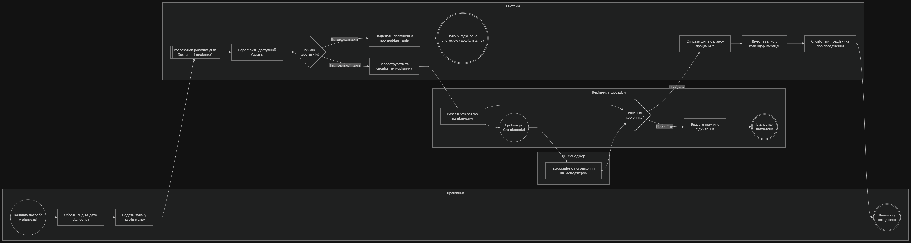
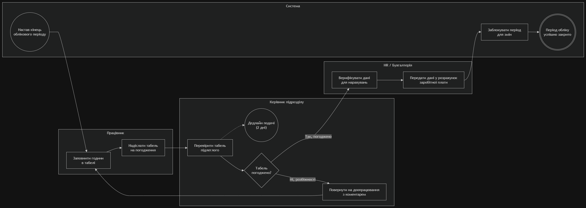
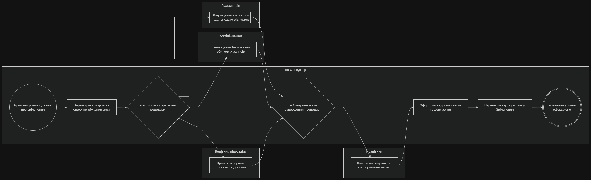

# Моделі бізнес-процесів у нотації BPMN 2.0 («Персонал+»)

> **Продукт:** «Персонал+» (HRM, slug: `personal`)  
> **Спринт:** Спринт 1 («Продукт і вимоги»)  
> **Дата:** 12.09.2026  
> **Відповідальний за моделі (ІТ):** Шпилька Тимофій  
> **Рецензент (СМ):** Мініцька Анастасія  

---

## 1. Інструменти, стандарти та інструкція відкриття файлів

Усі моделі бізнес-процесів розроблені у нотації **BPMN 2.0 (Business Process Model and Notation)** за допомогою інструменту **diagrams.net (draw.io)** відповідно до вимог методичних вказівок курсу (розділи 1, 4.10, 7 DoD та 8) і збережені у двох взаємодоповнюючих форматах:

1. **`.drawio` (Diagrams.net XML):** вихідний векторний файл діаграми з повною розміткою пулів, доріжок, елементів BPMN 2.0, шлюзів, подій та атрибутів потоків.
2. **`.drawio.png` (PNG експорт високої чіткості):** растровий графічний експорт для миттєвого візуального перегляду у репозиторії GitHub, веб-браузері та звітності. Згенерований через diagrams.net зі збереженням вбудованої XML-моделі (dual-format).

### Як відкрити та редагувати моделі:

#### Варіант А: Через веб-редактор `diagrams.net` (draw.io)
1. Відкрийте у браузері [app.diagrams.net](https://app.diagrams.net).
2. Оберіть **File $\rightarrow$ Open From $\rightarrow$ Device** (або перетягніть файл методом Drag & Drop у вікно редактора).
3. Оберіть файл `.drawio` або `.drawio.png` (draw.io автоматично зчитує вбудовану XML-структуру з PNG).
4. Діаграма відкриється для повноцінного перегляду та інтерактивного редагування.
5. Для збереження змін оберіть **File $\rightarrow$ Save As** або **File $\rightarrow$ Export As $\rightarrow$ PNG / PDF**.

#### Варіант Б: Через настільний додаток Draw.io Desktop
1. Завантажте та запустіть Draw.io Desktop.
2. Відкрийте будь-який файл `.drawio` чи `.drawio.png` із цієї папки.

#### Варіант В: У середовищі розробки VS Code
1. Встановіть офіційне розширення **Draw.io Integration** (від Henning Dieterichs).
2. Відкрийте файл `.drawio` або `.drawio.png` безпосередньо у VS Code для миттєвого візуального редагування прямо в IDE.

---

## 2. Склад змодельованих процесів

Згідно з нормативом для команди з 4 осіб, з 4 бізнес-процесів каталогу повністю змодельовано **3 ключові процеси**:

---

### Модель 1: «Подання й погодження відпустки»
* **Вихідний файл:** [`01_leave_approval.drawio`](01_leave_approval.drawio)
* **Графічний експорт:** [`01_leave_approval.drawio.png`](01_leave_approval.drawio.png)
* **Призначення:** Базовий процес продукту «Персонал+» та фундамент для реалізації нової функції «Самообслуговування відпусток».
* **Пули та доріжки:** Пул `Компанія «Персонал+»` містить 4 доріжки: `Працівник`, `Керівник підрозділу`, `HR-менеджер`, `Система`.
* **Особливості BPMN-елементів:**
  * *Шлюз XOR за даними 1:* «Баланс достатній?» (валідація тривалості відпустки);
  * *Шлюз XOR за даними 2:* «Рішення керівника?» (погодити або відхилити);
  * *Проміжна подія-таймер:* Boundary interrupting timer event «3 робочі дні без відповіді» на межі задачі керівника з автоматичною ескалацією до HR-менеджера;
  * *Підпроцес:* розгорнутий підпроцес розрахунку робочих днів та виключення святкових дат;
  * *Артефакти даних:* об'єкт даних `Заявка на відпустку` та сховище даних `Реєстр відпусток`.

#### Візуальне прев'ю Моделі 1:

---

### Модель 2: «Облік робочого часу (табель)»
* **Вихідний файл:** [`02_timesheet.drawio`](02_timesheet.drawio)
* **Графічний експорт:** [`02_timesheet.drawio.png`](02_timesheet.drawio.png)
* **Призначення:** Регламентний щомісячний процес звітності співробітників та нарахування виплат.
* **Пули та доріжки:** Пул `Компанія «Персонал+»` містить 4 доріжки: `Працівник`, `Керівник підрозділу`, `HR / Бухгалтерія`, `Система`.
* **Особливості BPMN-елементів:**
  * *Початкова подія:* Start Timer Event «Настав кінець облікового періоду» (тригер за розкладом);
  * *Проміжна подія-таймер:* Non-interrupting timer event «Дедлайн подачі (2 дні)» для надсилання нагадувань;
  * *Шлюз XOR за даними:* «Табель погоджено?» з поверненням потоку на доопрацювання (цикл зворотної дії);
  * *Артефакт даних:* об'єкт даних `Звіт відпрацьованих годин`.

#### Візуальне прев'ю Моделі 2:

---

### Модель 3: «Звільнення співробітника (Offboarding)»
* **Вихідний файл:** [`03_offboarding.drawio`](03_offboarding.drawio)
* **Графічний експорт:** [`03_offboarding.drawio.png`](03_offboarding.drawio.png)
* **Призначення:** Комплексний міждепартаментний процес завершення співпраці із працівником.
* **Пули та доріжки:** Пул `Компанія «Персонал+»` містить 5 доріжок: `Працівник`, `HR-менеджер`, `Керівник підрозділу`, `Адміністратор`, `Бухгалтерія`.
* **Особливості BPMN-елементів:**
  * *Паралельний шлюз ТА (Parallel AND Split):* одночасний запуск трьох паралельних гілок (прийом справ керівником, блокування облікового запису адміністратором, підпроцес розрахунку компенсації невикористаної відпустки бухгалтерією);
  * *Синхронізуючий шлюз ТА (Parallel AND Join):* обов'язкове очікування завершення всіх 3 паралельних дій перед поверненням майна та видачею наказу;
  * *Підпроцес:* згорнутий підпроцес бухгалтерського розрахунку виплат;
  * *Кінцева подія:* «Звільнення успішно оформлено».

#### Візуальне прев'ю Моделі 3:

---

## 3. Відповідність нормативам Definition of Done Спринту 1

- [x] **Кількість моделей:** рівно 3 моделі бізнес-процесів (норматив для 4 осіб виконано).
- [x] **Вихідні файли та графічний експорт:** для кожної моделі наявний вихідний файл `.drawio` та графічний експорт `.drawio.png` (повна відповідність Розділу 7 DoD: *"вихідний файл (.drawio / .bpmn) і експорт (PDF або PNG)"*).
- [x] **Різноманіття шлюзів:** у наборі використано $\ge 3$ різні типи шлюзів:
  1. *Виключне АБО за даними (Exclusive Data-based XOR)* — у всіх трьох моделях;
  2. *Паралельний ТА (Parallel AND)* — розгалуження та синхронізація у Моделі 3;
  3. *Граничні події-таймери (Event-based boundary timers)* — у Моделях 1 та 2.
- [x] **Підпроцеси:** присутній розгорнутий підпроцес у Моделі 1 та згорнутий підпроцес у Моделі 3 (норматив $\ge 1$ підпроцес виконано).
- [x] **Чек-лист коректності:** усі 3 моделі пройшли рецензування за 10 пунктами нотації BPMN 2.0 (протокол зафіксовано у [`sprint1/bpmn/review.md`](review.md)).
