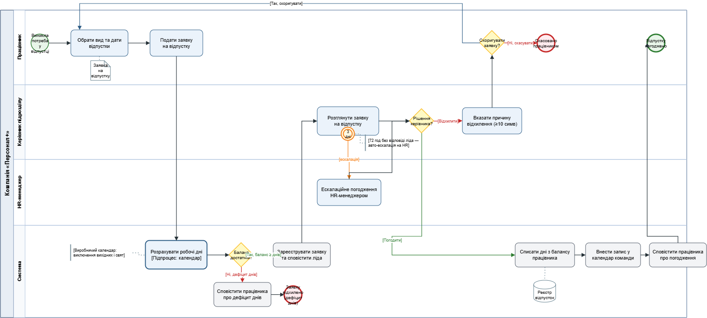
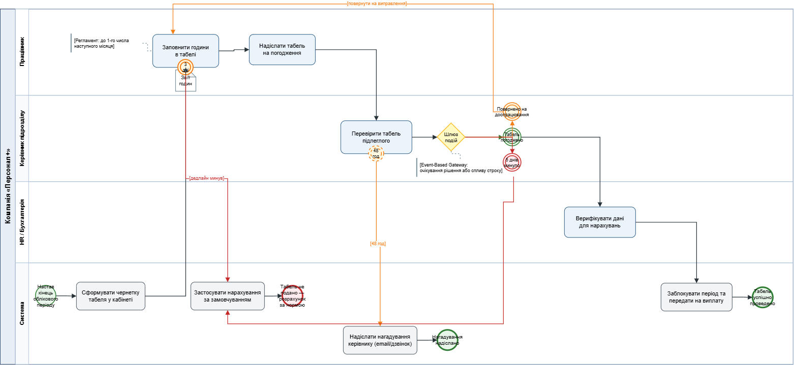
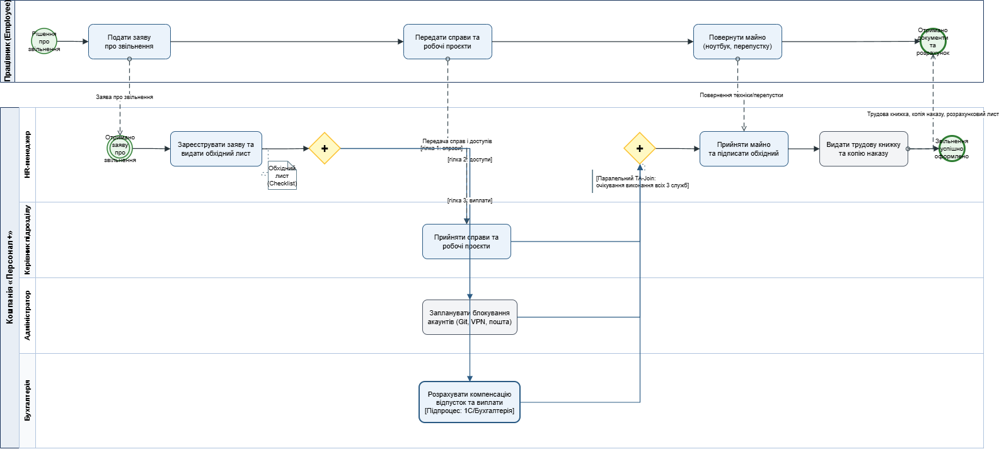

# Моделі бізнес-процесів у нотації BPMN 2.0 («Персонал+»)

> **Продукт:** «Персонал+» (HRM, slug: `personal`)  
> **Спринт:** Спринт 1 («Продукт і вимоги»)  
> **Дата:** 24.09.2026 (доопрацьовано: 01.10.2026 за результатами рев'ю)  
> **Відповідальний за моделі (ІТ):** Шпилька Тимофій  
> **Рецензент (СМ):** Мініцька Анастасія

---

## 1. Інструменти, стандарти та інструкція відкриття файлів

Усі моделі бізнес-процесів розроблені у нотації **BPMN 2.0 (Business Process Model and Notation)** відповідно до чек-листа §4.9 та стандарту OMG BPMN 2.0 за допомогою інструменту **diagrams.net (draw.io) версії v24.7.17**.

Артефакти збережені у двох взаємодоповнюючих форматах:
1. **`.drawio` (Diagrams.net Native BPMN 2.0 XML):** вихідний файл діаграми з повноцінною розміткою пулів, доріжок, елементів бібліотеки BPMN 2.0 (`shape=mxgraph.bpmn.*`), подій, граничних таймерів, шлюзів, артефактів даних та потоків. Кожен файл містить строго **одну відповідну сторінку**.
2. **`.drawio.png` (High-Res PNG із вбудованими метаданими XML):** растровий графічний експорт для перегляду у репозиторії GitHub, веб-браузері та звітах. Містить у чанках метаданих повний вихідний XML (`mxfile`), що дозволяє відкривати і редагувати `.png` безпосередньо у diagrams.net.

### Як відкрити та редагувати моделі:
- **У веб-браузері:** відкрити [https://app.diagrams.net/](https://app.diagrams.net/) $\rightarrow$ обрати меню *File* $\rightarrow$ *Open from* $\rightarrow$ *Device* $\rightarrow$ вибрати файл `.drawio` або `.drawio.png`.
- **У десктопному додатку:** запустити **diagrams.net Desktop v24.7.17** $\rightarrow$ *Open Existing Diagram*.
- **У середовищі розробки (VS Code / Antigravity IDE):** встановити розширення *Draw.io Integration* (від Henning Dieterichs) і відкривати файли прямо в редакторі.

---

## 2. Склад змодельованих процесів та виконання критеріїв DoD

Згідно з нормативом для команди з 4 осіб, з процесів каталогу повністю змодельовано **3 ключові наскрізні процеси**:

| Параметр | Модель 1: Відпустки | Модель 2: Табель | Модель 3: Звільнення | Вимога набору (DoD) |
| :--- | :---: | :---: | :---: | :---: |
| **Вихідний файл** | `01_leave_approval.drawio` | `02_timesheet.drawio` | `03_offboarding.drawio` | 3 моделі (норматив 4 ос.) |
| **Експорт** | `01_leave_approval.drawio.png` | `02_timesheet.drawio.png` | `03_offboarding.drawio.png` | Наявний для кожної моделі |
| **Типи шлюзів** | Exclusive XOR (×3) | Event-Based Gateway + Exclusive XOR (×2) | Parallel AND Split + Parallel AND Join | **$\ge 3$ типи у наборі (XOR, Event-based, Parallel AND)** |
| **Підпроцеси** | «Розрахунок робочих днів» | — | «Розрахувати компенсації та виплати» | **$\ge 1$ підпроцес у наборі** |
| **Граничні події** | Interrupting Timer (3 дні) | Non-interrupting Timer (48 год) | — | Граничні таймери на межах задач |
| **Артефакти даних** | Data Object + Data Store | Data Object | Data Object | **Артефакти даних присутні** |
| **Пули та Message Flows** | 1 пул, 4 доріжки | 1 пул, 4 доріжки | 2 окремі пули + 3 Message Flows | **Потоки повідомлень присутні** |
| **Текстові анотації** | Анотація правила 72 год | Анотація правила 48 год | Анотація синхронізації 3 відділів | **Анотації присутні** |

---

## 3. Детальний опис моделей

### Модель 1: «Подання й погодження відпустки»

- **Вихідний файл:** [`01_leave_approval.drawio`](01_leave_approval.drawio)
- **Графічний експорт:** [`01_leave_approval.drawio.png`](01_leave_approval.drawio.png)
- **Призначення:** Базовий процес самообслуговування відпусток продукту «Персонал+» (очікування №1–5).
- **Пули та доріжки:** Пул `Компанія «Персонал+»` містить 4 доріжки: `Працівник`, `Керівник підрозділу`, `HR-менеджер`, `Система`.
- **Ключові елементи BPMN 2.0:**
  - *Початкова подія (None):* «Виникла потреба у відпустці» (доріжка `Працівник`);
  - *Дія та об'єкт даних:* User Task «Заповнити заявку на відпустку», зв'язана асоціацією з Data Object `Заявка на відпустку`;
  - *Підпроцес:* Subprocess «Розрахунок робочих днів» (автоматичний підрахунок виключення вихідних і свят);
  - *Шлюз XOR 1:* «Баланс достатній?»:
    - `[Ні]` $\rightarrow$ End Event «Відхилено через дефіцит балансу»;
    - `[Так]` $\rightarrow$ передача заявки на розгляд керівнику;
  - *Граничний таймер (Boundary Interrupting Timer):* `3 дні (72 год) без відповіді` на межі задачі «Розглянути заявку»: перериває дію та ескалує процес до задачі «Ескалація: розглянути заявку» у доріжці `HR-менеджер`;
  - *Шлюз XOR 2:* «Рішення керівника / HR?»:
    - `[Погоджено]` $\rightarrow$ Service Task «Зафіксувати відпустку та списати баланс» у доріжці `Система`, що оновлює Data Store `Реєстр відпусток` $\rightarrow$ End Event «Відпустку затверджено»;
    - `[Відхилено]` $\rightarrow$ перехід до сповіщення працівника;
  - *Цикл реакції на відхилення:* User Task «Отримати сповіщення про відхилення» у доріжці `Працівник` $\rightarrow$ Шлюз XOR 3 «Бажає скоригувати дати?»:
    - `[Так, скоригувати]` $\rightarrow$ зворотна петля на задачу «Заповнити заявку на відпустку»;
    - `[Ні, скасувати]` $\rightarrow$ End Event «Заявку скасовано працівником»;
  - *Текстова анотація:* `[ 72 год без відповіді керівника -> авто-ескалація до HR`.

#### Візуальне прев'ю Моделі 1:

---

### Модель 2: «Облік робочого часу (табель)»

- **Вихідний файл:** [`02_timesheet.drawio`](02_timesheet.drawio)
- **Графічний експорт:** [`02_timesheet.drawio.png`](02_timesheet.drawio.png)
- **Призначення:** Щомісячний регламентний процес обліку фактично відпрацьованого часу співробітників.
- **Пули та доріжки:** Пул `Компанія «Персонал+»` містить 4 доріжки: `Працівник`, `Керівник підрозділу`, `HR / Бухгалтерія`, `Система`.
- **Ключові елементи BPMN 2.0:**
  - *Початкова подія (Timer):* «Настав кінець облікового періоду» (автоматичний тригер за розкладом о 09:00 останнього дня місяця);
  - *Шлюз за подіями (Event-Based Gateway):* точка очікування двох взаємовиключних подій:
    - *Гілка 1 (Intermediate Timer Event):* «Дедлайн минув (2 дні)» $\rightarrow$ Service Task «Нарахування за замовчуванням (оклад 100%)» $\rightarrow$ End Event «Табель не подано вчасно — нараховано за замовчуванням»;
    - *Гілка 2 (Intermediate Message/Event):* «Табель подано» $\rightarrow$ передача на перевірку;
  - *Дія та об'єкт даних:* User Task «Заповнити та надіслати табель» (доріжка `Працівник`) з асоційованим Data Object `Звіт годин`;
  - *Граничний непереривний таймер (Boundary Non-Interrupting Timer):* `48 год без перевірки` на контурі задачі «Перевірити табель»: не блокує дію перевірки, а паралельно активує Service Task «Надіслати нагадування керівнику» $\rightarrow$ End Event «Нагадування надіслано»;
  - *Шлюз XOR:* «Табель погоджено?»:
    - `[Так]` $\rightarrow$ User Task «Звірити години та нарахувати зарплату» у доріжці `HR / Бухгалтерія` $\rightarrow$ End Event «Табель затверджено, з/п нараховано»;
    - `[Ні, є розбіжності]` $\rightarrow$ User Task «Доопрацювати табель» $\rightarrow$ Шлюз XOR «Подати повторно?»:
      - `[Так]` $\rightarrow$ зворотна петля на повторне подання;
      - `[Ні]` $\rightarrow$ End Event «Табель скасовано працівником»;
  - *Текстова анотація:* `[ Понад 48 год без перевірки -> нагадування керівнику`.

#### Візуальне прев'ю Моделі 2:

---

### Модель 3: «Звільнення співробітника (Offboarding)»

- **Вихідний файл:** [`03_offboarding.drawio`](03_offboarding.drawio)
- **Графічний експорт:** [`03_offboarding.drawio.png`](03_offboarding.drawio.png)
- **Призначення:** Комплексний міждепартаментний процес припинення трудових відносин (HR, IT, Бухгалтерія).
- **Пули та доріжки (BPMN Collaboration):**
  - Окремий пул `Працівник` (Black-box pool з діями взаємодії);
  - Пул `Компанія «Персонал+»` із трьома доріжками: `HR-менеджер`, `IT-адміністратор`, `Бухгалтерія`.
- **Потоки повідомлень (Message Flows):**
  - Пунктирний потік «Заява про звільнення» від пулу `Працівник` до початкової події пулу `Компанія`;
  - Пунктирний потік «Повідомлення про погодження» від `HR-менеджер` до пулу `Працівник`;
  - Пунктирний потік «Вихідні документи та розрахунковий лист» від `HR-менеджер` до пулу `Працівник`.
- **Ключові елементи BPMN 2.0:**
  - *Паралельний шлюз ТА (Parallel AND Split):* після прийому заяви розгалужує процес на три паралельні обов'язкові дії:
    1. Доріжка `HR-менеджер`: User Task «Провести вихідне інтерв'ю»;
    2. Доріжка `IT-адміністратор`: Service Task «Заблокувати облікові записи»;
    3. Доріжка `Бухгалтерія`: Subprocess «Розрахувати компенсації та виплати»;
  - *Синхронізуючий шлюз ТА (Parallel AND Join):* очікує завершення всіх трьох паралельних дій перед тим, як дозволити наступний крок;
  - *Дія та об'єкт даних:* User Task «Повернути майно та підписати обхідний лист», асоційована з Data Object `Обхідний лист`;
  - *Фінальна дія:* Service/User Task «Видати наказ про звільнення та трудову книжку» $\rightarrow$ End Event «Співробітника успішно звільнено»;
  - *Текстова анотація:* `[ Паралельне виконання: HR + IT + Бухгалтерія з наступною синхронізацією`.

#### Візуальне прев'ю Моделі 3:

---

## 4. Висновок
Усі три моделі побудовані з дотриманням синтаксису BPMN 2.0, перевірені за 10 пунктами чек-листа §4.9 (деталі у [`review.md`](review.md)), збережені у єдиній сторінці на файл та повністю відповідають вимогам Definition of Done Спринту 1.
